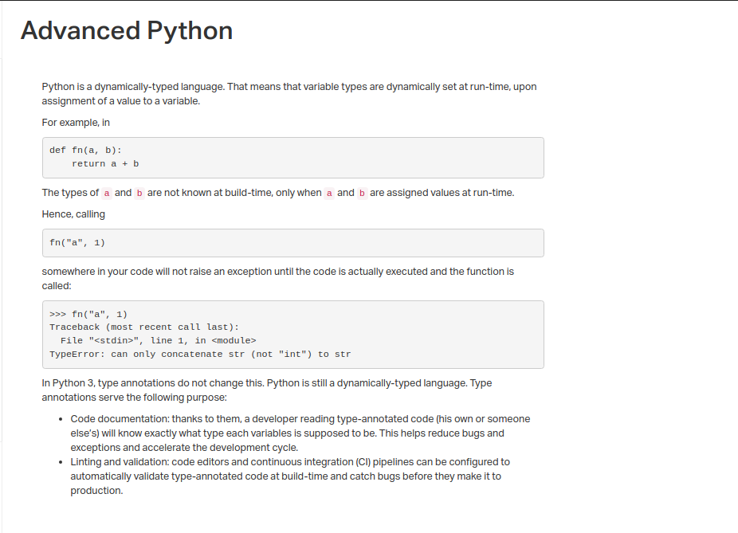
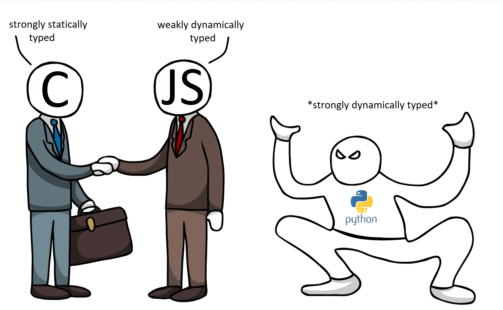

# 0x00. Python - Variable Annotations

## Concepts
##### <li>Advance Phyton</li>

## Resources

<b>Read or watch:</b>

##### <li>[Python 3 typing documentation](https://intranet.hbtn.io/rltoken/AgrgHs3ohrFJnT3Eece1UQ)</li>
##### <li>[MyPy cheat sheet](https://intranet.hbtn.io/rltoken/iEWC38l9R9216w1Y-x8pMg)</li>

## Learning Objectives

At the end of this project, you are expected to be able to explain to anyone, without the help of Google:

##### <li>Type annotations in Python 3</li>
##### <li>How you can use type annotations to specify function signatures and variable types</li>
##### <li>Duck typing</li>
##### <li>How to validate your code with mypy</li>

